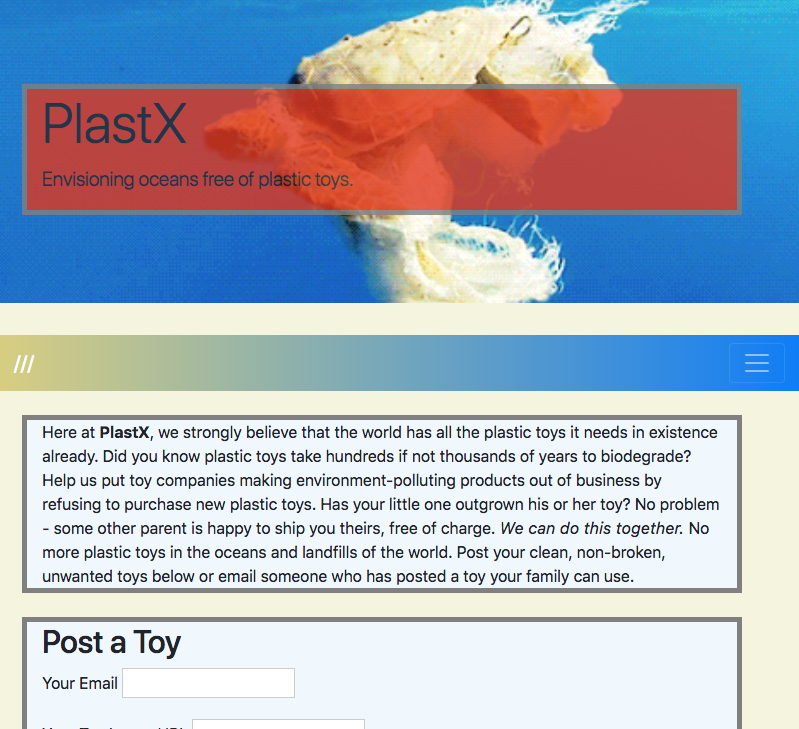

# PlastX
A Platform for Reusing/Sharing plastic toys so as to keep plastic out of our Oceans 




## Demo Day Slide Deck:
https://docs.google.com/presentation/d/1WCEA4127wJaEcv2XlEYQ_lSZZaYR9-PZmo-n4RNiVpA/edit#slide=id.gd9c453428_0_16

## Deployed at:
https://dvdkrstndnls.github.io/noplastictoys/

## Team
David Daniels, Sherry Yang, Hasan Mustafa, Brad Palmer


## Getting Started

These instructions will get you a copy of the project up and running on your local machine for development and testing purposes. See deployment for notes on how to deploy the project on a live system.

### Prerequisites

What things you need to install the software and how to install them

```
A code editor like VS Code
Firebase - https://firebase.google.com/docs/web/setup
```

### Installing

Other than interfacing with Firebase - see link above, this project is pretty straightforward - clone the code and run in your editor or choice

## Deployment

You may deploy using Github pages - https://guides.github.com/features/pages/

## Acknowledgments

* Thumbs up to the organizers of EarthXHack, April 2018, Dallas TX for which this project was built.

